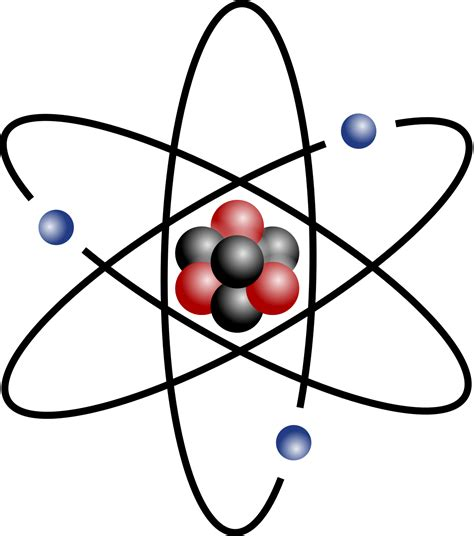

# Atomic splitter: A small django app connected to a servlerless API for molecule decomposition

Atomic splitter is made up of a serverless backend hosted on aws, which source code can be found here : https://github.com/benblc/serverless-atom-counting
And a django frontend deployed on Heroku (https://dashboard.heroku.com/) at the following adress : https://intense-basin-05890.herokuapp.com/polls/detail/
The source code for the django web app is in this repository !
